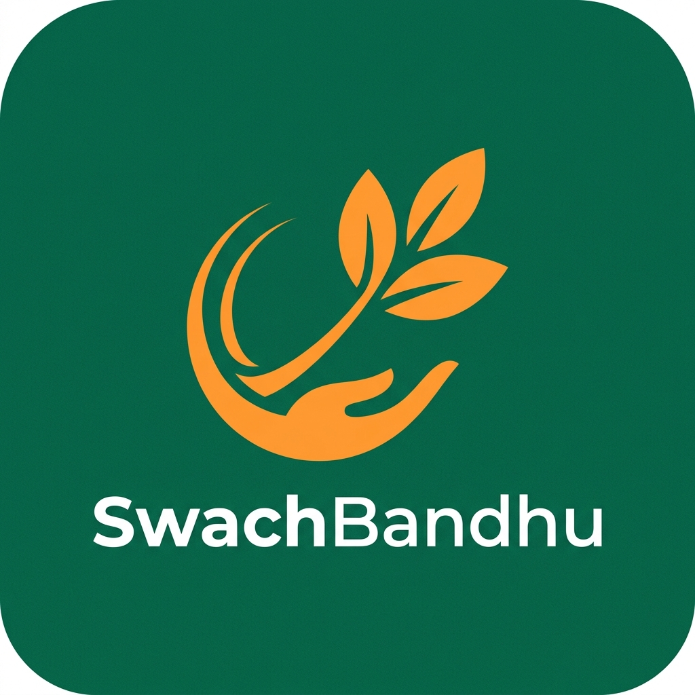

  
   
  <h1>SwachBandhu</h1>
  
<strong>REPORT ಮಾಡಿ, CHANGE ನೋಡಿ</strong>

  
<em>The Next-Generation Civic Social Network</em>

   
  
  <a href="https://swachbandhu.site/"><strong>Explore the Platform »</strong></a>
   
   

---

## 🌍 The Platform

**SwachBandhu** is a highly polished, community-driven civic network that bridges the gap between citizens, students, and municipal authorities. We have reimagined civic engagement as a seamless, visual, and highly rewarding social experience. 

Designed with an unapologetic focus on premium aesthetics and native-app level performance, SwachBandhu empowers individuals to take charge of their city's cleanliness through verifiable, AI-assisted reporting and transparent tracking.

## ✨ Core Experience

- **Live Geospatial Mapping:** A high-performance, real-time pollution map tracking urban waste hotspots with interactive mapping technology.
- **Social Feed:** An intuitive, scrolling media feed highlighting recent reports, community cleanups, and civic heroes.
- **Progressive Web App (PWA):** Installs seamlessly on iOS and Android devices, delivering a smooth, native-like experience complete with safe-area optimizations.
- **Swachh Coins Ecosystem:** Every verified cleanup algorithmically rewards the citizen with Swachh Coins, creating a gamified loop of civic duty.
- **Academic Integration:** Streamlined tools for university students (e.g., VTU) to participate in and verify community service batches for academic credit.
- **Admin Command Center:** A secure, robust dashboard allowing administrators to manage cleanup drives, verify reports, and oversee platform activity.

## 🛠️ Technology Ecosystem

Built to scale, SwachBandhu relies on a modern, high-performance web stack:

- **Frontend Core:** Next.js (App Router), React 19
- **Styling & Motion:** Tailwind CSS v4, Framer Motion
- **Database & Auth:** Firebase Firestore (with strict security rules), Firebase Authentication
- **Mapping:** React-Leaflet
- **Infrastructure:** Vercel Global Edge Network

## 🤝 Join the Movement

SwachBandhu is actively expanding across Bengaluru. If you are a municipal authority, an educational institution looking to integrate VTU batch tracking, or an environmental NGO, we would love to partner with you.

**[Contact the Founders](https://swachbandhu.site/about)** to discuss bringing SwachBandhu to your jurisdiction or campus.

---

  <h3>Built with ❤️ for a Cleaner Bengaluru.</h3>
  
Initiative by <b>KP Sumanth</b> & <b>Pranav SP</b>

